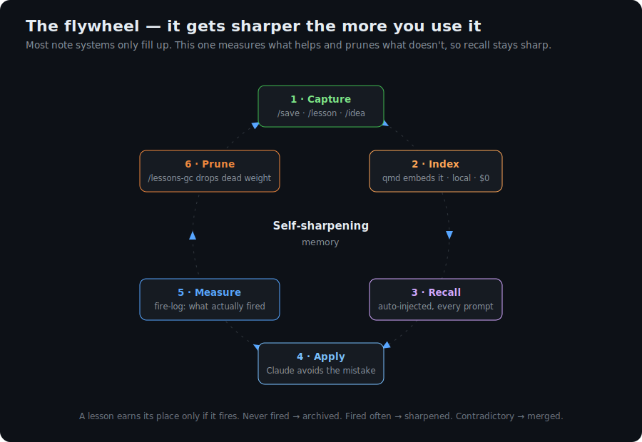
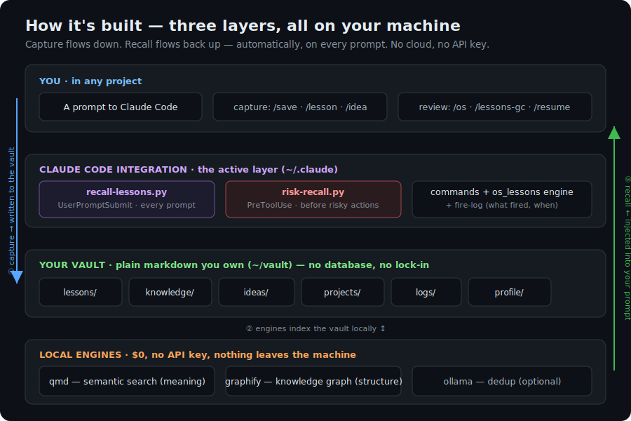
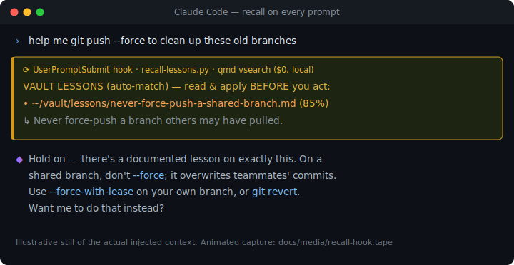
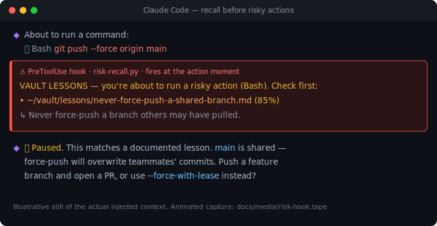
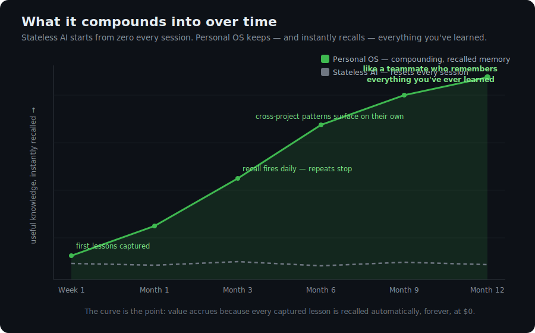

[English](README.md) · [Deutsch](README.de.md)

# Personal OS

> **Gib Claude Code ein Gedächtnis, das es nicht verlieren kann — und das sich nicht wiederholt.**
> Ein lokales Wissenssystem für $0, in reinem Markdown, das dir gehört, und das bei jedem Prompt *automatisch* die passende Lesson abruft.


---

## Der Pitch in 15 Sekunden

Claude Code startet jede Session mit Amnesie. Es stellt Fragen erneut, die du längst beantwortet hast, macht Fehler wieder, die du schon debuggt hast, und vergisst die hart erkämpften Entscheidungen von gestern. Das Kontextfenster setzt sich zurück und dein Wissen verdampft.

Die übliche Lösung ist ein „zweites Gehirn“ — aber das ist **passiver Speicher**. Es hilft nur, wenn *du* daran denkst, es abzufragen — also genau in dem Moment, in dem du längst vergessen hast, dass die Lesson überhaupt existiert. Ein Notizbuch, das du erst aufschlagen musst, ist kein Gedächtnis; es ist ein Aktenschrank.

**Personal OS ist anders: Das Gedächtnis durchsucht sich selbst.** Bei *jedem* Prompt läuft eine lokale semantische Suche und schiebt die relevanten vergangenen Lessons direkt in Claudes Kontext — ungefragt. Direkt vor einer riskanten Aktion (ein Force-Push, ein `rm -rf`, ein Deploy) holt es genau die Lessons wieder hoch, die *in diesem exakten Moment* zählen. Alles läuft auf deiner Maschine, in reinem Markdown, das dir gehört, **ohne API-Keys und ohne Cloud — $0.**

---

## Warum das eine große Sache ist

Was KI-Coding ausbremst, ist nicht Intelligenz — es ist **Amnesie**. Personal OS behebt das eine fehlende Teil, und zwar so, dass es auf jeder Achse zugleich kaum zu schlagen ist:

- 🧠 **Recall ist automatisch, nicht manuell.** Speichern ist leicht; *im richtigen Moment ans Abrufen zu denken* ist der schwere Teil. Zwei Hooks machen das Abrufen unwillkürlich — bei jedem Prompt, und noch einmal direkt vor allem Riskanten.
- 📈 **Es verzinst sich.** Jede Lesson, die du festhältst, zahlt sich für immer weiter aus, weil sie bei jedem künftigen Prompt in jedem Projekt kostenlos abgerufen wird. Wissen wächst an, statt sich zurückzusetzen.
- ✂️ **Es bleibt scharf.** Anders als ein Notizenhaufen, der nur wächst, *misst* es, welche Lessons tatsächlich feuern, und *prunet* den toten Ballast — so steigt die Recall-Qualität mit der Zeit, statt zu sinken. Es erntet sogar Lessons aus Sessions, die du ohne `/save` beendet hast, und prüft via `/os doctor` die eigene Gesundheit.
- 🔒 **Es gehört dir, und es ist kostenlos.** Reines Markdown auf deiner Platte, keine Datenbank, kein Anbieter, kein Lock-in. Sämtliche Inferenz läuft über lokale GGUF-Modelle — **niemals ein API-Key, $0** — also verlassen dein Code und deine Notizen nie die Maschine.
- 🌍 **Es ist sprachunabhängig.** Recall ist semantisch und mehrsprachig: Eine auf Deutsch geschriebene Lesson taucht bei einem englischen Prompt auf, und umgekehrt.

---

## Das Schwungrad

Die meisten Notizsysteme füllen sich nur. Personal OS dreht eine geschlossene Schleife, die das Gedächtnis **schärfer macht, je mehr du es nutzt**:



Festhalten → indexieren → **Recall (automatisch)** → anwenden → **messen**, was tatsächlich gefeuert hat → **prunen**, was es nie tut. Eine Lesson verdient ihren Platz nur, wenn sie feuert; nie gefeuerte Lessons werden archiviert, häufig gefeuerte geschärft. Genau dieser Schritt aus Messen und Prunen hält den Recall präzise, statt in Beinahe-Duplikaten zu ertrinken.

---

## Wie es gebaut ist

Drei dünne Schichten, alle auf deiner Maschine — das Festhalten fließt nach unten, der Recall wieder nach oben:



1. **Dein Vault** — ein Obsidian-artiger Ordner aus reinem Markdown (`lessons/`, `ideas/`, `knowledge/`, `projects/`, `logs/`, `profile/`). Dir gehört jede Datei.
2. **Claude-Code-Integration** — zwei Hooks (`recall-lessons.py`, `risk-recall.py`), acht Slash-Befehle und eine kleine Mess-/Prune-Engine, eingebunden in `~/.claude`, ohne dein bestehendes Setup anzurühren.
3. **Lokale Engines** — [`qmd`](https://github.com/tobi/qmd) für semantische Suche, [`graphify`](https://github.com/safishamsi/graphify) für Graph-Abfragen, optional `ollama` für Dedup. Alles $0, alles offline.

Das Ganze installiert sich mit einem einzigen Befehl und ist vollständig reversibel.

---

## Der Clou: zweistufiger automatischer Recall

Zwei Hooks erledigen die Arbeit — und genau das gibt dir keine passive Notiz-App:

**`recall-lessons.py` — `UserPromptSubmit`** führt bei **jedem Prompt** eine **lokale semantische Suche** aus (`qmd vsearch`, $0, keine API) und injiziert die relevanten vergangenen Lessons in Claudes Kontext. Claude hört auf, dokumentierte Fehler zu wiederholen — *ohne dass du fragst*.



<sub>Illustratives Standbild des real injizierten Kontexts. Erzeuge eine animierte Aufnahme mit [`docs/media/recall-hook.tape`](docs/media/recall-hook.tape) (vhs).</sub>

**`risk-recall.py` — `PreToolUse`** feuert direkt **vor riskanten oder nach außen wirkenden Aktionen** — `git push --force`, `rm -rf`, `reset --hard`, Deploys, `npm publish`, eine Datenbank droppen, Mail verschicken — und holt genau die Lessons wieder hoch, die in dem präzisen Moment zählen, in dem ein Fehler dich teuer zu stehen käme.



<sub>Illustratives Standbild des real injizierten Kontexts. Erzeuge eine animierte Aufnahme mit [`docs/media/risk-hook.tape`](docs/media/risk-hook.tape) (vhs).</sub>

---

## Dreaming — der Vault konsolidiert sich nachts selbst

Recall beantwortet „was weiß ich schon über *das hier*?" Dreaming beantwortet die Frage, die niemand stellt: „was sollte mir über alles hinweg auffallen?" Einmal pro Nacht (Opt-in: `--schedule-dream`) läuft ein kurzer lokaler Durchgang wie ein Gehirn, das im Schlaf Erinnerungen konsolidiert — rechnet über den ganzen Vault, lässt den Autopiloten die risikoarme Schicht ausführen (nächste Sektion) und schreibt **eine Nachtjournal-Notiz**, sonst nichts.

Die ehrliche Mechanik — acht Pässe, bewusst billig:

| Pass | Was er findet | Inferenz |
|---|---|---|
| `fires` | welche Lessons diese Woche feuerten, welche heiß laufen, wo der Recall *danebengriff* | keine (liest das Fire-Log) |
| `producer` | rendert Cold-Outreach-Entwürfe aus einer Lead-Queue, die **du** selbst befüllst | keine — reines Templating (ein Modell kann den Pain-Point eines echten Leads nicht erfinden) |
| `gc-digest` | Merge-/Cross-Link-Kandidaten unter den Lessons | lokale Embeddings (ollama) |
| `connections` | Notizen, die zusammengehören, aber nie `[[verlinkt]]` sind | qmd vsearch (Embeddings, kein LLM) |
| `ventures` | wenn ein brandneues Projekt die „Form" deiner vergangenen done/parked-Ventures teilt | lokale Embeddings + transitiver Ähnlichkeits-Check; höchstens ein LLM-Call, um das Verdikt zu formulieren |
| `triage` | welche Review-Inbox-Drafts zu deinen aktiven Projekten passen | lokale Embeddings (ollama) |
| `residue` | „Was gestern passierte"-Digest aus Logs + neuen Chats | **der einzige Pflicht-LLM-Pass** — ein kleines lokales Modell (Default `llama3.2:3b`), hart gedeckelte Call-Zahl |
| `report` | baut das Nachtjournal: ausgeführte Aktionen zuerst, dann alles, was sonst feuerte | keine |

Leitplanken — ein unbeaufsichtigter Nachtjob verdient sich Vertrauen, oder er verdient nichts:

- **Pässe editieren nie echte Notizen.** Die Pässe rechnen nur; die Ausführung ist eine getrennte, journalte Schicht (der Autopilot, unten) mit harten Regeln, was sie anfassen darf. Producer-Entwürfe sind Textdateien in `_inbox/producer-drafts/` — ein echter Gmail-Entwurf entsteht ausschließlich über `/producer review` nach einem Ja, und gesendet wird nie.
- **Harte Caps überall** — max. gescannte Notizen, max. Vorschläge, max. LLM-Calls, ein Venture-Muster pro Nacht. Eine Traumnotiz ist eine Zwei-Minuten-Lektüre, keine zweite Inbox. Pass-State ist owner-only und wird nach 7 Tagen geprunt.
- **Feedback ohne Ritual** — jedes `/undo` zählt als *rejected*, und ein nächtlicher Scanner bewertet, was du mit den Artefakten stillschweigend *getan* hast (Link zwei Wochen behalten = accepted; entfernt = rejected). Das speist dieselben adaptiven Schwellwerte wie zuvor: Zähler, kein ML.
- **Kill-Switch:** `touch ~/.claude/personal-os/dream.off`. Ein RAM-Pre-Flight skippt die LLM-Pässe auf einer ausgelasteten Maschine; jeder Pass ist resumefähig; die Modelle werden nach dem Lauf entladen.

Weiterhin $0, weiterhin lokal: qmd + ollama sind die einzige Inferenz, nirgends in der Pipeline existiert ein API-Key.

---

## Der Autopilot — handelt still, Undo in einer Minute

Version 0.3 hat höflich gefragt: jede Nacht eine Vorschlagsnotiz, jede Checkbox wartete auf Review. Die Telemetrie war eindeutig — die Vorschlagsnotizen stapelten sich, und **keine einzige wurde je reviewt**. Ein Gedächtnissystem, das um Erlaubnis bittet, die es nie bekommt, ist nur ein Tagebuch mit Extraschritten. Also invertiert 0.4 den Vertrag — *nur für die risikofreie Schicht*: **still ausführen, alles journalen, Undo billiger machen, als Genehmigung je war.**

Was der Autopilot nachts tun darf (jeweils gedeckelt, jeweils abschaltbar):

| Tier | Aktion | Cap |
|---|---|---|
| 0a | reziproke `[[Wikilinks]]` zwischen kuratierten Notizen setzen (append-only, unter `## Links`, nie während du die Datei gerade bearbeitest) | 6/Nacht |
| 0b | maschinengenerierte Refs-Karten >21 Tage außerhalb der Top 30 archivieren (nur `status: inbox\|parked` — unbekannte Herkunft wird nie angefasst) | — |
| 0c | Traumnotizen älter als 3 Tage auf `superseded` setzen (nur das Frontmatter-Feld) | — |
| 0d/1 | Chat-Mining- und Harvest-Queue drainieren: ein strenger lokaler Judge („im Zweifel NEIN") hakt eine Session ab oder destilliert einen Lesson-**Draft** nach `_inbox/lessons/` | 10 + 5/Nacht |

Was er **nie** tut: irgendetwas löschen, den Body einer kuratierten Notiz editieren, `chats/`-Rohdateien oder `profile/` anfassen, eigene Drafts selbst promoten.

Die Vertrauensmechanik:

- **Actions-Journal** (`actions.jsonl`): jede Aktion wird mit verbatim Undo-Daten protokolliert, *bevor* du sie je siehst. `/undo` rollt eine Aktion, eine Nacht oder alles zurück — mit Precondition-Checks: was du inzwischen selbst geändert hast, wird übersprungen, nie überschrieben.
- **Implizites Feedback**: Undo = rejected. Link überlebt zwei Wochen = accepted. Draft promotet oder editiert = accepted; 45 Tage unberührt = rejected. Die Engine wird genau dort konservativer, wo du zurückschiebst — ganz ohne Review-Ritual.
- **Eine Morgen-Notification**, auf einmal pro Tag gedrosselt: „OS heute Nacht: 3 Links, 2 Drafts · /undo möglich". Die Details stehen im Nachtjournal (`/dream`).
- **Kill-Switches, gestaffelt:** `touch ~/.claude/personal-os/autopilot.off` stoppt die Ausführung, die Pässe rechnen weiter; `dream.off` stoppt alles.

Parallel dazu kommen **aktive Leitplanken** — still handeln funktioniert nur, wenn die riskante Richtung ebenfalls bewacht ist: ein deterministischer PreToolUse-Hook (`guard.py`) kompiliert deine meistfeuernden Lessons zu echten deny/ask/warn-Entscheidungen — benannte Probes im Code, nie Shell aus JSON, fail-open bei jedem Fehler, `POS_GUARD=skip` als geloggte Notluke und ein `ask-only`-Schattenwochen-Modus, bevor du scharf schaltest. `preflight.sh` stempelt einen Typecheck+Author-Marker, den die Deploy-Guard prüft, und ein SessionStart-Brief injiziert Hub-Stand, offene Punkte und die Top-3-Lessons — jede Session startet wissend statt fragend.

Der ehrliche Vorbehalt: der Draft-Schreiber ist ein lokales 3B-Modell. Seine Lesson-Drafts sind an guten Tagen mittelmäßig und an unordentlichen schlechter — genau deshalb landen sie als `confidence: low`-Drafts in `_inbox/lessons/`, die du promotest, schärfst oder ignorierst, und nie in deinem kuratierten Lessons-Ordner. Der Wert des Autopiloten ist nicht Prosaqualität, sondern dass die Queues jede Nacht auf null drainieren und nichts mehr auf ein Review wartet, das du nie machen wolltest.

---

## Worauf es sich mit der Zeit aufsummiert

Das ist der Teil, der ein Gedächtnis von einem Notizbuch trennt. Ein zustandsloser Assistent startet jede Session für immer bei null. Personal OS klettert immer weiter:



- **Woche 1** — du hältst deine ersten Lessons fest; der Recall fängt an, sie hochzuspülen.
- **Monat 3** — der Recall feuert täglich; dieselben Fehler hören schlicht auf, wiederzukehren.
- **Monat 6** — projektübergreifende Muster tauchen von selbst auf; `/lessons-gc` hält den Speicher kompakt.
- **Monat 12** — es arbeitet wie ein erfahrener Teamkollege, der sich an *alles erinnert, was du je gelernt hast* — und es hat dich $0 gekostet und nie deinen Laptop verlassen.

---

## Wie es sich unterscheidet

| | Notiz-App / „zweites Gehirn“ | Cloud-KI-Assistent-Gedächtnis | **Personal OS** |
|---|:---:|:---:|:---:|
| Ruft **automatisch** ab, ohne Nachfrage | ✗ du musst suchen | ~ undurchsichtig, manchmal | ✓ jeder Prompt **+ vor riskanten Aktionen** |
| Ein Gedächtnis über **alle** Projekte | ~ passiv | ~ pro Produkt | ✓ jedes Repo |
| **Dir gehören** die Daten (reine Dateien) | ✓ | ✗ beim Anbieter | ✓ reines Markdown, lokal |
| Wird mit der Zeit **schärfer** | ✗ wächst nur | ✗ undurchsichtig | ✓ messen + prunen |
| Läuft **offline**, kein API-Key | ✓ | ✗ | ✓ 100 % lokal |
| **Kosten** | $ | $ / Abo | **$0** |

---

## Zwei Abrufmodi: Bedeutung vs. Struktur

| | **qmd** | **graphify** |
|---|---|---|
| **Beantwortet** | „Hatten wir das schon mal?“ | „Was hängt zusammen / was bricht?“ |
| **Modus** | BEDEUTUNG (semantisch) | STRUKTUR (Wissensgraph) |
| **Wie** | Hybrid aus BM25 + Vektor + RRF + Rerank; multilingual | `query` / `path` / `explain` / `affected` |
| **Wofür** | Paraphrasierte oder sprachübergreifende Lessons | Links und Blast-Radius über Notizen hinweg verfolgen |
| **Kosten** | $0, lokal | $0, lokal |

**Faustregel: qmd = meaning, graphify = structure.** Beide laufen vollständig auf deiner Maschine.

---

## Quickstart

**Voraussetzungen:** [Claude Code](https://docs.anthropic.com/en/docs/claude-code) und Python 3.

```bash
# 1. Install the retrieval dependencies (each under its own license — see Credits)
npm install -g @tobilu/qmd
uv tool install graphifyy

# 2. Clone and install Personal OS
git clone <repo> && cd personal-os
./install/install.sh
```

Der Installer legt `~/vault` an, führt die Befehle/Hooks/Skills in `~/.claude` zusammen — **ohne deine bestehenden Einstellungen zu überschreiben** —, schreibt die qmd-Index-Konfiguration und baut den ersten Index. Öffne dann Claude Code in **irgendeinem** Projekt und probiere `/lesson`, `/save`, `/os`. Prüfe die Verdrahtung jederzeit mit `python3 install/doctor.py` (es führt eine echte Recall-Abfrage Ende-zu-Ende aus).

Optionale Flags, die sich lohnen:

```bash
./install/install.sh --schedule        # nächtlicher Graph-Rebuild + Index-Refresh (04:15)
./install/install.sh --schedule-dream  # nächtlicher Dreaming-Pass (04:45, siehe oben)
./install/install.sh --autopush        # Opt-in: Vault am Session-Ende committen+pushen
                                       # (Allowlist-Staging — chats/ + _inbox/ können nie
                                       #  gepusht werden; Vault braucht ein eigenes privates Remote)
python3 install/install.py --check-drift   # später: installiert vs. Repo vs. Install-Manifest
```

---

## Befehle

| Befehl | Was er tut |
|---|---|
| `/save` | Schreibt ein datiertes Session-Log; erntet automatisch Lessons & Ideen aus der Session |
| `/resume` | Baut den Kontext neu auf — liest die neuesten Logs und Entscheidungen, fasst den Stand zusammen |
| `/lesson` | Hält einen Fehler + Fix + *Warum* fest (dedupliziert gegen bestehende Lessons) |
| `/idea` | Hält eine Idee fest (`hook` \| `video` \| `posting` \| `product`) |
| `/os` | Dashboard über alle Projekte — Lessons, Ideen, Hubs, offene Punkte |
| `/mine-chats` | Destilliert Learnings aus importierten Chat-Transkripten |
| `/lessons-gc` | Prunet kalte, veraltete und doppelte Lessons, um den Speicher scharf zu halten |
| `/harvest` | Destilliert Lessons & Ideen aus Sessions, die ohne `/save` endeten, in eine Review-Inbox |
| `/dream` | Zeigt das Nachtjournal — was der Autopilot ausgeführt hat + Tagesrest |
| `/undo` | Rollt Autopilot-Aktionen zurück — letzte Nacht komplett oder gezielt nach Anzahl/Datum/Id |
| `/ask` | Eine Frage, alle Gedächtnisse — qmd + Chats + Graph parallel, mit Quellen beantwortet |
| `/producer` | Zeigt (oder `review`) wartende Cold-Outreach-Textentwürfe — echte Gmail-Drafts nur nach einem Ja, nie gesendet |

---

## Anforderungen

- **OS:** macOS oder Linux (Windows über WSL) · **Claude Code** · **Python 3**
- **qmd** — erforderlich (semantischer Recall) · **graphify** — optional (struktureller Recall) · **ollama** — optional (`/lessons-gc`-Dedup und der optionale nächtliche Dreaming-Pass)

Das Repo wird **datenfrei** ausgeliefert: nur das Framework plus eine Handvoll generischer Beispiel-Notizen (z. B. *„never force-push a shared branch“*, *„cap LLM API costs“*). Siehe [`docs/`](docs/) für **SETUP**, **CONCEPTS**, **VAULT**, **COMMANDS** und [`docs/examples/os-dashboard.md`](docs/examples/os-dashboard.md) für ein Beispiel-Dashboard.

---

## Kosten & Datenschutz

**$0. Lokal. Deins.** Personal OS nutzt nie einen API-Key. Sämtliche Inferenz läuft auf deiner eigenen Maschine und **deine Daten verlassen nie deinen Laptop.** Es funktioniert über **alle** deine Projekte hinweg, nicht nur ein Repo. Der Vault ist reines Markdown, das dir gehört — keine Datenbank, keine Cloud, kein Lock-in.

---

## FAQ

**Brauche ich API-Keys?** Nein. Niemals. Sämtlicher Recall läuft lokal über `qmd vsearch`. Es gibt keinen Kostenpfad.

**Funktioniert es unter Windows?** Ja, über WSL. Native Ziele sind macOS und Linux.

**Kann ich meinen bestehenden Obsidian-Vault nutzen?** Ja — der Vault ist einfach ein Obsidian-artiger Markdown-Ordner. Der Installer überschreibt keine bestehenden `~/.claude`-Einstellungen; richte den Index auf deinen eigenen Vault, wenn du magst.

**Was, wenn ich graphify / ollama weglasse?** Beide sind optional. Ohne graphify verlierst du den strukturellen (Graph-)Recall, behältst aber den vollen semantischen Recall. Ohne ollama verlierst du den Dedup-Durchlauf in `/lessons-gc` und die Dreaming-Pässe, die Embeddings brauchen (die LLM-freien laufen weiter). qmd ist die eine erforderliche Abhängigkeit.

**Was ist „Dreaming"?** Ein optionaler dritter Nightly-Job (`--schedule-dream`), der den Vault konsolidiert, während du schläfst — verdichtet den gestrigen Tag, schlägt `[[Wikilinks]]` zwischen Notizen vor, die sich nie referenzieren, flaggt Lesson-Merge-Kandidaten, rankt deine Review-Inbox, erkennt, wenn ein brandneues Projekt die Form vergangener gescheiterter Ventures teilt, und rendert (wenn du selbst eine Lead-Queue befüllst) Cold-Outreach-Entwürfe aus deinen eigenen Playbooks. Er schreibt eine reine Vorschlagsnotiz pro Nacht nach `_inbox/dreams/` und fasst nie eine echte Notiz an oder versendet etwas; Review über `/dream review` und `/producer review`. Die meisten Pässe sind reine Embedding-/Graph-Arbeit ganz ohne LLM — siehe die Sektion oben und `docs/COMMANDS.md` §3c.

**Kann ich meine ChatGPT-Historie importieren?** Ja — `scripts/chatgpt_to_obsidian.py --zip <export.zip>` konvertiert einen ChatGPT-Datenexport in denselben Vault (`chats/gpt/`), inkrementell, sodass `/mine-chats` ihn destillieren kann. Ein manueller Einmal-Lauf, kein Teil des Nightly-Schedulers; siehe `docs/SETUP.md`.

**Werden meine Daten irgendwohin gesendet?** Nein. Die Inferenz ist lokal und der Vault bleibt auf deiner Maschine. Es wird nichts hochgeladen.

**Ist es zweisprachig?** Ja. Der semantische Recall nutzt multilinguale Qwen3-Embeddings, sodass deine Notizen in jeder Sprache sein können und der Recall *sprachübergreifend* funktioniert.

---

## Credits & Attribution

Personal OS steht auf zwei exzellenten lokalen Tools:

- **qmd** — semantische Suche. Von Tobi Lutke. MIT. https://github.com/tobi/qmd
- **graphify** — Wissensgraph. Von Safi Shamsi. MIT. https://github.com/safishamsi/graphify
- **ollama** — optionale lokale Inferenz für den `/lessons-gc`-Dedup. https://ollama.com

> **qmd und graphify sind erforderlich, werden aber NICHT mitgeliefert — du installierst sie selbst; dieses Repo liefert ihren Code nie aus.** Jedes bleibt unter seiner eigenen Lizenz.

---

## Lizenz

MIT. Siehe [`LICENSE`](LICENSE).
